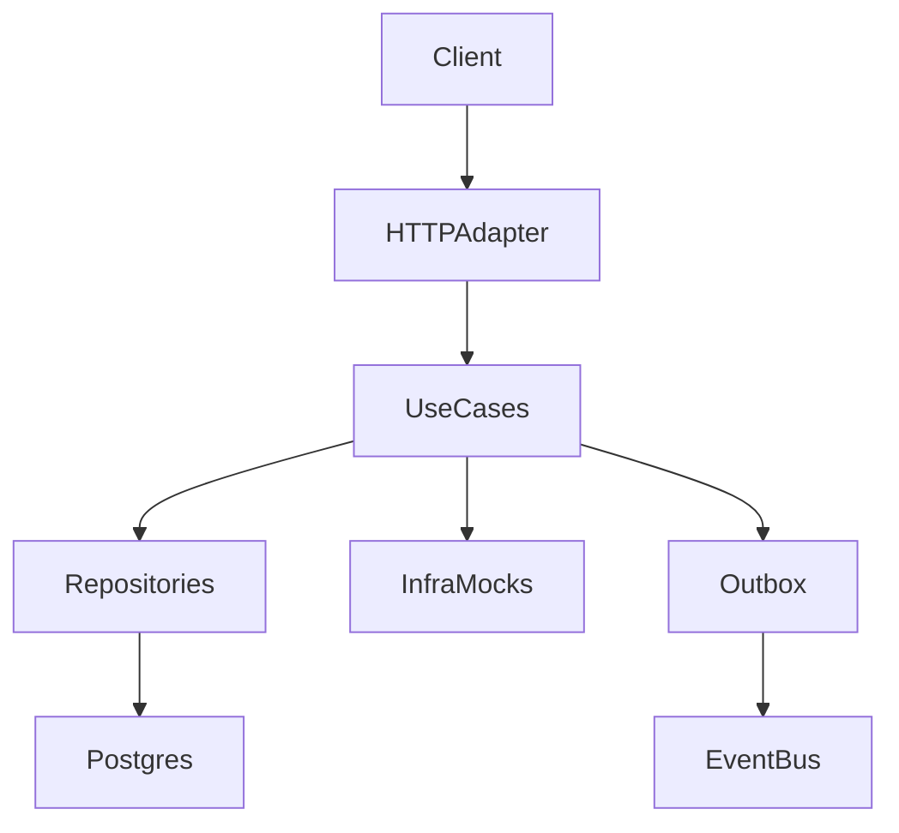

# Arquitetura — Zetta Finance Platform

## Visao geral
- Go + PostgreSQL, Clean Architecture.
- Ledger append-only, saldo calculado por `CONFIRMED`.
- Idempotencia obrigatoria para operacoes de escrita.
- UoW garante consistencia e locks pessimistas.

## Camadas
1) **Adapter HTTP**: rotas, validacao, auth, rate limit, responses.
2) **Use cases**: regras de negocio e orquestracao.
3) **Domain/Entity**: modelos de negocio.
4) **Repositories**: Postgres (UoW + repos).
5) **Infra**: observabilidade, outbox, mocks de cripto/custodia.

## Fluxo de autenticacao
1) POST `/auth/login` com email/senha.
2) Bcrypt valida senha.
3) Access token (HS256) + Refresh token (hash armazenado).
4) Rotas protegidas exigem `Authorization: Bearer`.
5) Refresh token rotativo em `/auth/refresh`.

## Autorizacao
User so acessa contas que pertencem ao seu `user_id`.
Validacao por middleware e checagens em handlers.
Rotas /admin exigem role ADMIN.

## Custodia (white label)
Sem custodia propria. Integração via:
- `CustodyGateway` (interface).
- `MockGateway` com latencia/erro/timeout para testes.

## Frontend (Z-FINANCE)
- UI estatica com login dedicado e rotas por hash: dashboard, operacoes, compliance, config, observabilidade.
- Conecta diretamente aos endpoints do backend via Authorization Bearer.
- CORS habilitado para ambientes de demo (origens configuraveis por env `CORS_ORIGINS`).

## Compliance (VASP-ready)
Modelagem interna:
- `ComplianceCase` e `ComplianceEvent`.
Fluxos:
- criar casos em operacoes de risco,
- registrar eventos e auditoria.
Sem vendors pagos.
Base regulatoria:
- `roles`, `user_roles`, `role_separation_rules`.
- `regulatory_profiles` com jurisdicao, risco e flags (travel rule/AML).

## Observabilidade
Basica:
- `expvar` para metrics.
- `trace_id` + spans por fluxo (pix/payments/card/swap/invoices).
- OpenTelemetry via OTLP HTTP (configuravel).
- Admin endpoints para reconciliacao, observabilidade, auditoria e alertas.
- Retry/backoff de webhooks com fila e worker interno.

## Resiliencia e consistencia
- Operacoes criticas usam UoW com locks e ledger append-only.
- Falhas externas geram erro padronizado (dependencia externa) e nao confirmam saldo.
- Operacoes assincronas (webhooks) seguem consistencia eventual e podem ser reconciliadas.
- Reversoes criam novos eventos no ledger; nao alteram eventos originais.

## Integracoes futuras (IA/Wallet/DEX)
- IA apenas analisa e propoe intents; execucao real exige confirmacao explicita.
- Providers externos nunca alteram o ledger diretamente; apenas retornam dados.

## Monetizacao (Pricing Engine)
- Versoes de pricing (`pricing_versions`) com janela de validade.
- Features por plano (`plan_features`) para habilitar/desabilitar fluxos.
- Campanhas com override (`pricing_campaigns` + `pricing_campaign_rules`).
- Resolve centralizado em `ResolvePricingUseCase` (sem hardcode em handlers).

## Dados principais (Postgres)
- users, accounts, transactions, audit_logs
- roles, user_roles, role_separation_rules, regulatory_profiles
- pricing_versions, pricing_rules, plan_features
- pricing_campaigns, pricing_campaign_rules
- pix_transfers, payments, card_authorizations
- crypto_transfers, trade_orders
- user_settings, conversion_rules, invoices
- refresh_tokens, login_audits
- compliance_cases, compliance_events

## Diagrama (alto nivel)

