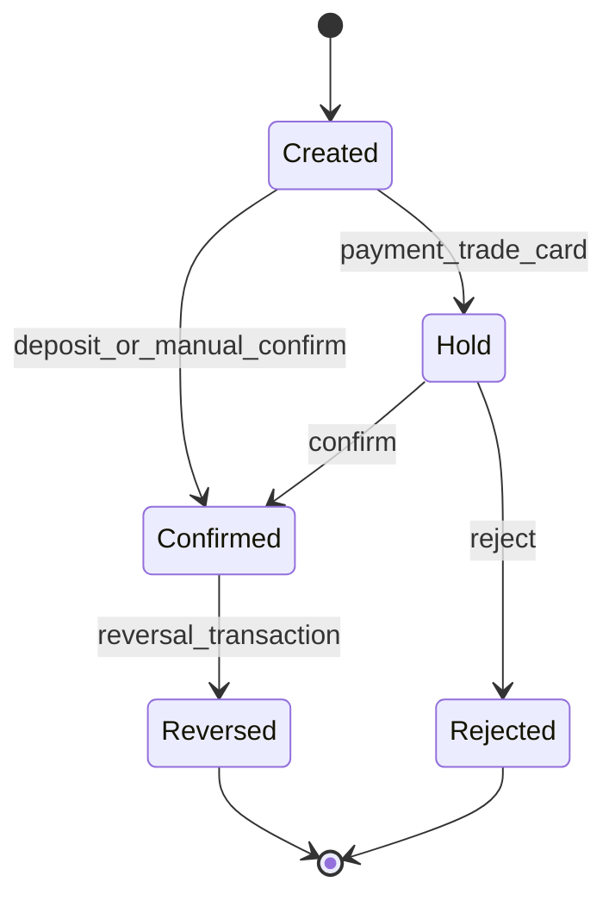
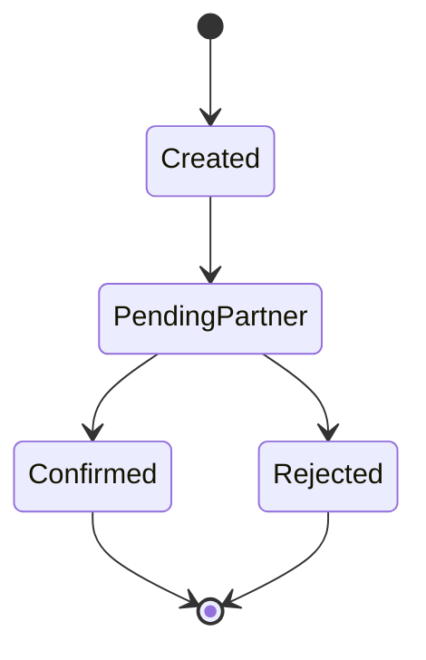
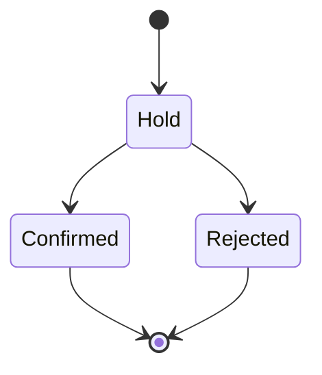
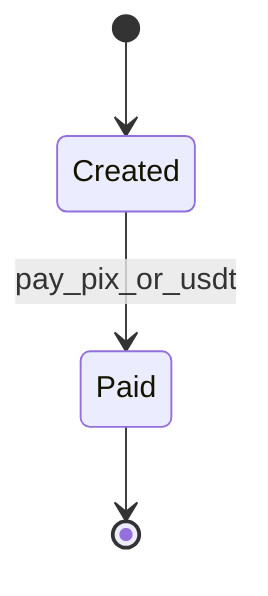

# State Machines — Z-FINANCE

Diagramas de estados para fluxos criticos. Use como referencia de negocio e para testes.

---

## Transacoes (ledger)

Nota: reversao cria uma nova transacao no ledger; nao altera o evento original.

---

## Pix (send)

---

## Payments (boletos)

---

## Card JIT

---

## Invoices (hibrido Pix + USDT)

